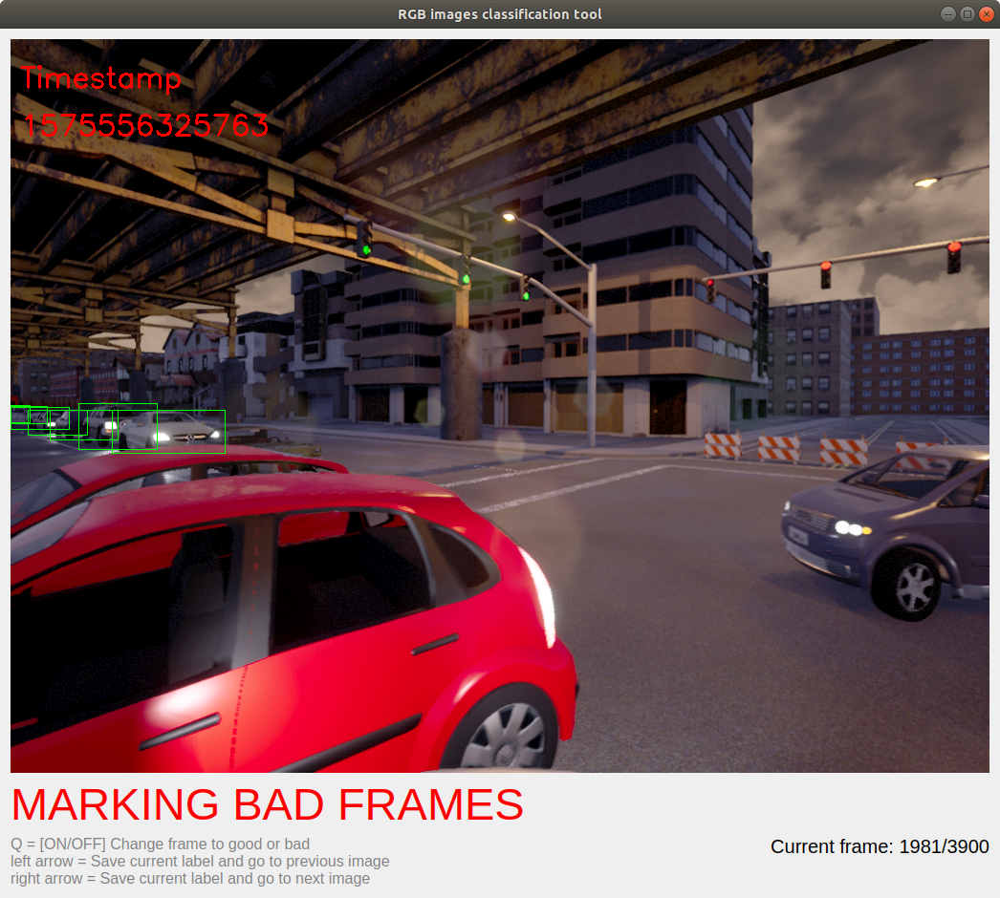

# Dataset GUI labeling tool
Tool created in Python 3 with PyQt5 which annotates valid frames from a HDF5 dataset into a DB file created with sqlite3. Was used mainly to help discard unusable frames from [CARLA created datasets](https://github.com/AlanNaoto/carla-dataset-runner) where recorded data at certain points could be seen as undesirable. Can also be extended to be a more generalistic classification tool by working on the MainApplication class.



## Getting started
### Prerequisites
* Python 3
* PyQt5
* h5py
* cv2
* numpy

### Installation
Clone this repo somewhere and install the prerequisites:

```
git clone https://github.com/AlanNaoto/Dataset_GUI_labeling_tool
pip3 install PyQt5 h5py opencv-python numpy
```

### Starting the tool
Inside the repo, run:

```
python3 main.py hdf5_file db_file
```
where:

* hdf5_file is the full path to the HDF5 dataset file
* db_file is the full path to the DB file. If it already exists, then it loads the last worked frame. If the DB file does not exists, then it creates a new one

If everything went right, the user interface should appear.


Available keystrokes are:
* Q - Changes the label marking to either "1" (good) or "0" (bad)
* Left and right arrows - Go back or advance one frame and saves the current label

## DB data output format
The database file has one main table - frames_analysis with the columns timestamps and good_frame, where timestamps are the already covered timestamps from the HDF5 input file and good_frame an integer 0 or 1.


- - -
Icon  made by andriy matviychuk from www.freeicons.io
